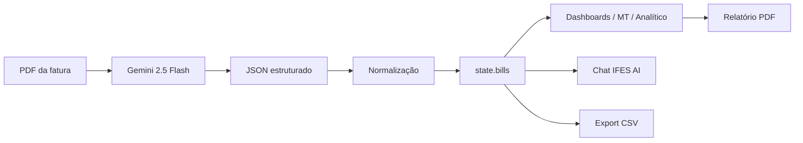

# IFES — Energy IA

Aplicação web para análise inteligente de contas de energia elétrica brasileiras (baixa e média tensão). O sistema importa faturas em PDF, extrai dados estruturados com a API **Google Gemini**, apresenta dashboards interativos e simula a **otimização de demanda contratada** para redução de custos em instalações do Grupo A (média tensão).

Desenvolvido no contexto do **Mestrado em Engenharia de Automação (IFES)**.

---

## Índice

1. [Visão geral](#visão-geral)
2. [Estrutura do projeto](#estrutura-do-projeto)
3. [Tecnologias utilizadas](#tecnologias-utilizadas)
4. [Como executar](#como-executar)
5. [Configuração da API Gemini](#configuração-da-api-gemini)
6. [Fluxo completo da aplicação](#fluxo-completo-da-aplicação)
7. [Passo a passo: importação de PDF](#passo-a-passo-importação-de-pdf)
8. [Modelo de dados da fatura](#modelo-de-dados-da-fatura)
9. [Normalização de demanda (kW)](#normalização-de-demanda-kw)
10. [Módulo Analítico — simulação de demanda](#módulo-analítico--simulação-de-demanda)
11. [Páginas e funcionalidades](#páginas-e-funcionalidades)
12. [Assistente IA (chat)](#assistente-ia-chat)
13. [Exportação de dados](#exportação-de-dados)
14. [Estado da aplicação](#estado-da-aplicação)
15. [Referência de funções principais](#referência-de-funções-principais)
16. [Limitações e avisos](#limitações-e-avisos)

---

## Visão geral

O **IFES Energy IA** resolve três problemas práticos para gestores de energia e engenheiros:

| Problema | Solução no sistema |
|----------|-------------------|
| Faturas MT são complexas e cheias de siglas | Extração automática + glossário com tooltips `(?)` |
| Difícil saber se a demanda contratada está adequada | Simulador com cenários P95, P99, conservador, agressivo e **Indicador IA** |
| Análise manual demorada | Chat com contexto das faturas importadas + exportação PDF/CSV |



---

## Estrutura do projeto

```
energy/
├── README.md                    ← este arquivo
├── energy-new/
│   └── ifes-energy.html         ← aplicação principal (SPA monolítica)
└── luminous-energy.html         ← versão anterior / protótipo
```

> **Arquivo principal:** `energy-new/ifes-energy.html` (~3.450 linhas). Toda a lógica (HTML, CSS, JavaScript) está em um único arquivo, sem build step nem backend.

---

## Tecnologias utilizadas

| Camada | Tecnologia |
|--------|------------|
| Interface | HTML5, [Tailwind CSS](https://tailwindcss.com) (CDN) |
| Gráficos | [Chart.js 4.4](https://www.chartjs.org) |
| PDF gerado | [jsPDF](https://github.com/parallax/jsPDF) + jsPDF-AutoTable |
| IA / OCR | [Google Gemini API](https://ai.google.dev) — modelo `gemini-2.5-flash` |
| Ícones | Google Material Symbols |
| Fontes | Space Grotesk, Inter |
| Persistência local | `localStorage` (apenas chave API) |

---

## Como executar

Não há `npm install` nem servidor obrigatório. Basta abrir o HTML no navegador:

1. Clone ou baixe o repositório.
2. Abra `energy-new/ifes-energy.html` no Chrome, Edge ou Firefox.
3. Configure a chave Gemini (recomendado) ou use o modo demo limitado.
4. Importe PDFs de contas de energia pelo botão **Importar PDF** ou arrastando na área lateral.

Para evitar restrições de CORS em alguns navegadores ao chamar a API Gemini, você pode servir o arquivo localmente:

```bash
# Python 3
cd energy-new
python -m http.server 8080
# Acesse http://localhost:8080/ifes-energy.html
```

---

## Configuração da API Gemini

1. Crie uma chave em [Google AI Studio](https://aistudio.google.com/apikey).
2. No app, clique em **API Key** na barra lateral.
3. Cole a chave (formato `AIza...`).
4. A chave é salva em `localStorage` com a chave `luminous_gemini_key`.

Sem chave configurada:
- Extração de PDF **não funciona** (retorna mensagem demo).
- Chat e insights usam resposta placeholder.

---

## Fluxo completo da aplicação

### 1. Inicialização (`DOMContentLoaded`)

Ao carregar a página:

- Verifica se existe chave Gemini salva.
- Exibe modal de token se necessário.
- Registra listeners de upload (input, drag-and-drop, chat).
- Navega para o **Painel de Controle** (`showPage('dashboard')`).
- Inicializa tooltips do glossário (`initTips()`).

### 2. Importação de fatura

```
Usuário seleciona PDF
    → fileToBase64()
    → extractBillData()          [2 etapas Gemini]
    → normalizeBillItems()       [classificação de itens]
    → normalizeDemanda()         [correção kW]
    → state.bills.push()
    → updateAllViews()           [atualiza todas as telas]
```

### 3. Análise e simulação

```
Usuário vai em Analítico → Executar simulação
    → getDemandMonths()          [filtra faturas MT com demanda]
    → runDemandSimulation()      [P95, P99, cenários, IA]
    → state.demandSimResult = ...
    → renderAnaliticoResults()   [KPIs, gráficos, laudo]
```

### 4. Exportação

- **CSV:** todas as faturas em planilha (`exportCSV()`).
- **PDF:** relatório técnico de otimização (`exportDemandPDF()`).

---

## Passo a passo: importação de PDF

A extração é feita em **duas chamadas** à API para evitar truncamento de tokens em faturas grandes.

### Etapa 1 — Dados básicos (`BASIC_EXTRACTION_PROMPT`)

Extrai cabeçalho e totais:

```json
{
  "mes": "dez/2024",
  "kwh": 45000,
  "valor": 12500.00,
  "multa": 0,
  "tipoTarifa": "MT",
  "distribuidora": "EDP",
  "subgrupo": "A4",
  "bandeira": "verde",
  "vencimento": "15/01/2025"
}
```

### Etapa 2 — Detalhamento (`DETAILS_EXTRACTION_PROMPT`)

Extrai itens linha a linha e blocos estruturados:

- `itens[]` — todos os lançamentos da fatura
- `demanda` — contratada e medida (kW)
- `energiaAtiva`, `energiaReativa`, `geracaoDistribuida`
- `impostos`, `DMCR`, `ERE`
- `historicoConsumo[]` — quadro "Histórico de Consumo" quando presente

### Pós-processamento (`processPDF`)

| Passo | Função | O que faz |
|-------|--------|-----------|
| 1 | `extractBillData` | Orquestra as 2 etapas Gemini |
| 2 | Parse numérico | Converte strings em números |
| 3 | `normalizeBillItems` | Classifica cada item (`energia`, `demanda`, `geracao`...) |
| 4 | `syncImpostosFromItens` | Preenche objeto `impostos` a partir dos itens |
| 5 | `syncGeracaoFromItens` | Preenche geração distribuída |
| 6 | `normalizeDemanda` | Corrige kW contratado e medido |
| 7 | Deduplicação | Substitui fatura do mesmo `mes` se já existir |
| 8 | Ordenação | `state.bills` ordenado cronologicamente |

### Classificação semântica de itens (`classifyItemTipo`)

Cada linha da fatura recebe um `tipo`:

| tipo | Significado | Exemplos |
|------|-------------|----------|
| `energia` | Consumo kWh | Energia Ativa Ponta, TUSD |
| `demanda` | Potência kW | Demanda Máxima FPonta |
| `reativa` | Penalidade reativa | Energia Reativa Excedente |
| `geracao` | Crédito GD (negativo) | Energia Inj. FPonta |
| `encargo` | DMCR, ERE, juros, multa | |
| `imposto` | CIP, ICMS em linha separada | |
| `desconto` | Retenções na fonte | Retenção PIS |

---

## Modelo de dados da fatura

Cada objeto em `state.bills` segue esta estrutura:

```javascript
{
  mes: "jan/2025",              // competência
  kwh: 42000,                   // consumo total
  valor: 429768,                // total R$
  multa: 0,
  tipoTarifa: "MT",             // "BT" ou "MT"
  distribuidora: "EDP",
  subgrupo: "A4",
  fileName: "fatura-jan.pdf",

  demanda: {
    contratadaPonta_kW: 0,
    contratadaFPonta_kW: 203,   // valor único de Grandezas Contratadas
    medidaPonta_kW: 0,
    medidaFPonta_kW: 176.8,     // pico do Histórico de Consumo
    valorPonta: 0,
    valorFPonta: 8500
  },

  historicoConsumo: [
    { mes: "jan/2025", demandaForaPonta_kW: 176.8, demandaPonta_kW: 0 }
  ],

  energiaAtiva: { ponta_kWh, foraPonta_kWh, valorPonta, valorForaPonta },
  energiaReativa: { ... },
  geracaoDistribuida: { ... },
  impostos: { CIP, ICMS, jurosMora, multaMora, retencaoPIS, ... },
  DMCR: { ponta_kW, foraPonta_kW, valorPonta, valorForaPonta },
  ERE: { ... },
  itens: [ { nome, descricao, consumo, unidade, tarifa, valor, tipo } ]
}
```

---

## Normalização de demanda (kW)

Regra crítica para faturas Grupo A: **nunca somar Ponta + Fora Ponta** quando ambos representam o mesmo contrato ou o pico do mês.

### Demanda contratada

Fonte: seção **Grandezas Contratadas** / **Demanda contratual**.

| Situação na fatura | Comportamento correto |
|--------------------|----------------------|
| Uma linha: 203 kW | `contratadaFPonta_kW = 203` |
| Duas linhas iguais (203 + 203) | Usar **203** (não 406) |
| Ponta e FPonta diferentes | Usar `Math.max()` — maior posto |

Funções envolvidas:
- `pickDemandContracted(conP, conFP)`
- `getDemandaContratadaTotal(b)`

### Demanda medida (pico)

Fonte: quadro **Histórico de Consumo** → coluna **Demanda Fora Ponta**.

| Situação | Comportamento |
|----------|---------------|
| Só Fora Ponta preenchida | Usa esse valor |
| Ponta vazia, FPonta = 190.1 | Pico = 190.1 kW |
| Ambos preenchidos | Prioriza Fora Ponta; nunca soma |

Funções envolvidas:
- `pickDemandMeasured(medP, medFP)`
- `applyHistoricoConsumoToDemanda(data)` — lê `historicoConsumo[]`
- `syncDemandaFromItens(data)` — fallback pelos itens da fatura
- `getDemandaMedidaTotal(b)`

### Re-normalização automática

`renormalizeAllBills()` é chamada em `updateAllViews()` para corrigir faturas já carregadas na sessão.

---

## Módulo Analítico — simulação de demanda

### Entrada

`getDemandMonths()` filtra faturas com dados de demanda e monta série mensal via `extractDemandMonth()`:

```javascript
{
  competencia: "2025-03",
  medida: 190.1,        // kW medido no mês
  contratada: 203,      // kW contratado
  valDem: 8500,         // R$ cobrado por demanda
  dmcr: 0,              // R$ ultrapassagem
  tarifaKw: 44.7        // R$/kW estimado
}
```

### Parâmetros padrão (`SIM_DEFAULTS`)

| Parâmetro | Valor | Significado |
|-----------|-------|-------------|
| `overMult` | 2 | Multiplicador de tarifa na ultrapassagem |
| `tolerance` | 5% | Tolerância regulatória simulada |
| `techMargin` | 3% | Margem técnica no cenário conservador |
| `IA_TOLERANCIA` | 10% | Faixa sem multa no Indicador IA |

### Motor de custo (`simulateDemandCost`)

Para cada mês e demanda contratada candidata `D`:

```
custo_base     = valorTotal - valDem - dmcr
custo_demanda  = D × tarifaKw
limite         = D × (1 + tolerância)
se medida > limite:
  custo_ultrapassagem = (medida - limite) × tarifaKw × overMult
custo_mês = custo_base + custo_demanda + custo_ultrapassagem
```

### Cenários calculados (`runDemandSimulation`)

| Cenário | Cálculo | Perfil |
|---------|---------|--------|
| **Conservador** | P99 × (1 + margem técnica) | Zero ultrapassagens |
| **Estatístico (P95)** | Percentil 95 das medidas | Cobre 95% dos meses |
| **Indicador IA** | `computeIARecommendation()` | Pico + tolerância 10% sem multa |
| **Ótimo custo** | `findOptimalDemand()` — varre D | Menor custo total |
| **Agressivo** | `findAggressiveDemand()` | Aceita até N meses com ultrapassagem |

### Indicador IA (`computeIARecommendation`)

1. Calcula pico máximo e mínimo do histórico.
2. Define `D` mínimo para cobrir o pico com 10% de folga sem multa.
3. Compara custo atual vs. custo com `D` recomendado.
4. Gera narrativa explicativa (`buildIANarrative`).
5. Opcionalmente regenera texto com Gemini (`regenerateIANarrative`).

### Saída (`state.demandSimResult`)

Armazena KPIs, cenários, tabela de economia, dados para gráficos e laudo PDF.

---

## Páginas e funcionalidades

### Painel de Controle (`dashboard`)

- KPIs: faturas analisadas, valor total, consumo médio, multas.
- Gráfico de barras kWh/R$ por mês.
- Insight executivo gerado por IA (`generateInsight`).
- Últimas faturas importadas.

### Análise de Energia (`analise`)

- Comparativo mês a mês.
- Variação vs. mês anterior e vs. ano anterior.
- Timeline de faturas.

### Média Tensão (`media-tensao`)

Detalhamento completo de uma fatura MT selecionada:

- KPIs: energia ativa, demanda contratada, geração injetada, encargos.
- Barras de composição de custos (`COST_GROUPS`).
- Donut de distribuição percentual.
- Tabela de itens com badges de tipo.
- Painel de impostos, retenções e geração distribuída.
- Gráfico comparativo entre meses.

### Analítico (`analitico`)

- Parâmetros: modalidade tarifária, janela de meses, passo de varredura.
- Botão **Executar simulação**.
- KPIs de demanda, custo e economia.
- 4 cards de cenário (conservador, P95, IA, agressivo).
- Gráficos: barras contratada vs. medida; linha temporal.
- Preview do relatório de otimização.
- Exportação PDF do laudo.

### Indicador IA (`indicador-ia`)

- Página dedicada à recomendação de demanda.
- Destaque visual com kW sugerido.
- Comparativo pico / mínimo / contratada / excesso.
- Gráfico medida vs. contratada vs. indicador.
- Export PDF específico do indicador.

### Assistente IA (`chat`)

- Chat multi-turno com histórico (`state.chatHistory`, máx. 24 turnos).
- Contexto automático: JSON de todas as faturas (`buildChatContext`).
- Upload de PDF direto no chat.
- Prompts rápidos pré-definidos.

### Histórico de Faturas (`historico`)

- Tabela completa de todas as faturas.
- Export CSV.

### Multas & Alertas (`alertas`)

- Lista faturas com multa ou juros.
- Total de penalidades no período.

---

## Assistente IA (chat)

### System prompt (`CHAT_SYSTEM`)

Define o IFES AI como especialista em contas brasileiras, com regras:
- Responder em português claro.
- Usar dados reais das faturas importadas.
- Não inventar valores.

### Chamada API (`callGemini`)

- Modelo: `gemini-2.5-flash`
- Suporta: texto, PDF inline (base64), system instruction, JSON mode.
- Tratamento de truncamento (`MAX_TOKENS`) com retry.

---

## Exportação de dados

### CSV (`exportCSV`)

Colunas: mês, tipo tarifa, kWh, valor, multa, bandeira, distribuidora, energia ponta/FP, demanda ponta/FP, reativa, GD, impostos.

Arquivo gerado: `ifes-energy-faturas.csv` (UTF-8 com BOM).

### PDF de otimização (`exportDemandPDF`)

Gera documento técnico com:
- Cabeçalho IFES + metadados do cliente
- Laudo textual
- Tabela de economia projetada
- Gráfico de demanda (captura do canvas Chart.js)
- Glossário de termos (`PDF_GLOSSARY`)

---

## Estado da aplicação

```javascript
const state = {
  bills: [],                    // faturas importadas
  geminiKey: '',                // chave API (localStorage)
  chatHistory: [],              // mensagens do chat
  showingKwh: true,             // toggle gráfico kWh/R$
  demandSimResult: null,        // último resultado da simulação
  analiticoCharts: {            // instâncias Chart.js
    bar: null, line: null,
    relatorio: null, indicador: null
  }
};
```

> **Nota:** As faturas ficam apenas em memória. Ao recarregar a página, é necessário importar os PDFs novamente.

---

## Referência de funções principais

### Núcleo

| Função | Responsabilidade |
|--------|------------------|
| `processPDF(file)` | Pipeline completo de importação |
| `extractBillData(b64)` | Extração Gemini em 2 etapas |
| `updateAllViews()` | Atualiza todas as telas |
| `showPage(name)` | Navegação SPA |

### Demanda

| Função | Responsabilidade |
|--------|------------------|
| `normalizeDemanda(data)` | Corrige kW após extração |
| `getDemandaMedidaTotal(b)` | Pico medido do mês |
| `getDemandaContratadaTotal(b)` | Demanda contratada única |
| `runDemandSimulation()` | Executa todos os cenários |
| `computeIARecommendation()` | Lógica do Indicador IA |

### Visualização MT

| Função | Responsabilidade |
|--------|------------------|
| `renderMTPage()` | Renderiza página média tensão |
| `renderMTCostBars(b)` | Barras de composição |
| `renderMTItemsTable(b)` | Tabela de lançamentos |

### Utilitários

| Função | Responsabilidade |
|--------|------------------|
| `parseMonthYear(s)` | Ordenação cronológica `mmm/AAAA` |
| `fmtR(v)` | Formatação monetária pt-BR |
| `percentile(arr, p)` | Percentil para P95/P99 |
| `extractJSON(raw)` | Parse robusto de JSON da IA |

---

## Limitações e avisos

1. **Simulação técnica** — não substitui parecer formal nem pedido à distribuidora.
2. **Qualidade da extração** depende do layout do PDF e da chave Gemini.
3. **Dados em memória** — sem persistência de faturas entre sessões.
4. **Modo demo** sem API não processa PDFs reais.
5. **Tarifas e regras** variam por distribuidora; parâmetros padrão são genéricos.
6. A versão `luminous-energy.html` é legado; use `energy-new/ifes-energy.html`.

---

## Fluxo recomendado para o usuário

```
1. Configurar API Key Gemini
2. Importar 12+ PDFs de faturas MT (Grupo A)
3. Conferir dados em "Média Tensão" (demanda contratada e pico)
4. Ir em "Analítico" → Executar simulação
5. Analisar Indicador IA e cenários P95/P99
6. Exportar relatório PDF para documentação
7. Usar o Chat para tirar dúvidas específicas sobre as faturas
```

---

## Licença e créditos

Projeto acadêmico — **IFES / Mestrado em Engenharia de Automação**.

Integração com **Google Gemini API** sujeita aos termos de uso do Google AI.
